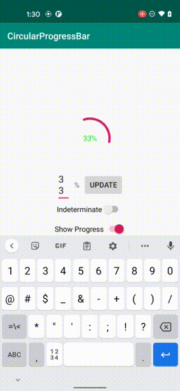

# ProgressCircula

[  ](https://bintray.com/2hamed/maven/ProgressCircula/_latestVersion)

ProgressCircula is a lightweight customisable circular ProgressBar view for Android. It has been written entirely in Kotlin and it includes only one file. The purpose was to mimick the behavior of [Telegram](https://telegram.org/) ProgressBar for messages.



### Usage
ProgressCircula is available through jCenter and you can easily include it in your `build.gradle` file.

```groovy
implementation 'com.hmomeni.progresscircula:progresscircula:0.1.2'
```

There are a number of customisation parameters which can be used either in xml or programmatically:

* `rimColor`: This specifies the color of ProgressBar ring
* `rimWidth`: The width of the progress ring in pixels
* `textColor`: Color of the progress text
* `showProgressText`: Whether to show the progress text or not
* `indeterminate`: This makes the progress bar indeterminate
* `progress`: With this you can update the progress of the progress bar, should be >=0 and <= 100

```xml
<com.hmomeni.progresscircula.ProgressCircula
        android:id="@+id/progressBar"
        android:layout_width="90dp"
        android:layout_height="90dp"
        app:indeterminate="true"
        app:progress="40"
        app:rimColor="@color/colorAccent"
        app:rimWidth="3dp"
        app:showProgress="true"
        app:textColor="#00FF00" />
```
